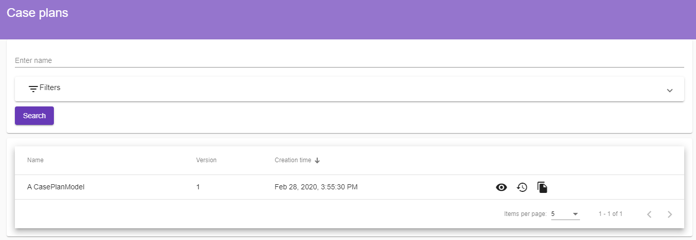
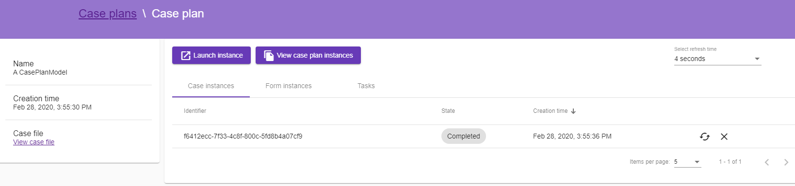
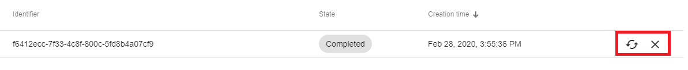

Launch a case clan instance
===========================

Always as a **business analyst**, click on the **Case plans** button under the **Cases** menu.
The window displays the list of case plans created by the authenticated business analyst.

Select a case plan to see its details, the window displays the following information :

* List of case worker tasks or forms which have been created during the execution of the case plan.
* List of case plan instances.

Click on the **Launch instance** button to create and launch a new case plan instance.
After 4 seconds, the instance will be displayed in the corresponding table. Different actions are displayed next to the instance, they can be performed by the **business analyst**.
A case plan instance has 6 different states and depending on them one or more actions can be performed.

+--------------------+------------------------------------------------------------------------------------------------------------------------------------------------------------------------+
| State              | Actions                                                                                                                                                                |
+====================+========================================================================================================================================================================+
| Active             | Suspend, Terminate                                                                                                                                                     |
+--------------------+------------------------------------------------------------------------------------------------------------------------------------------------------------------------+
| Completed          | Re-activate, close                                                                                                                                                     |
+--------------------+------------------------------------------------------------------------------------------------------------------------------------------------------------------------+
| Terminated         | Re-activate, close                                                                                                                                                     |
+--------------------+------------------------------------------------------------------------------------------------------------------------------------------------------------------------+
| Failed             | Re-activate, close                                                                                                                                                     |
+--------------------+------------------------------------------------------------------------------------------------------------------------------------------------------------------------+
| Suspended          | Re-activate, close                                                                                                                                                     |
+--------------------+------------------------------------------------------------------------------------------------------------------------------------------------------------------------+

