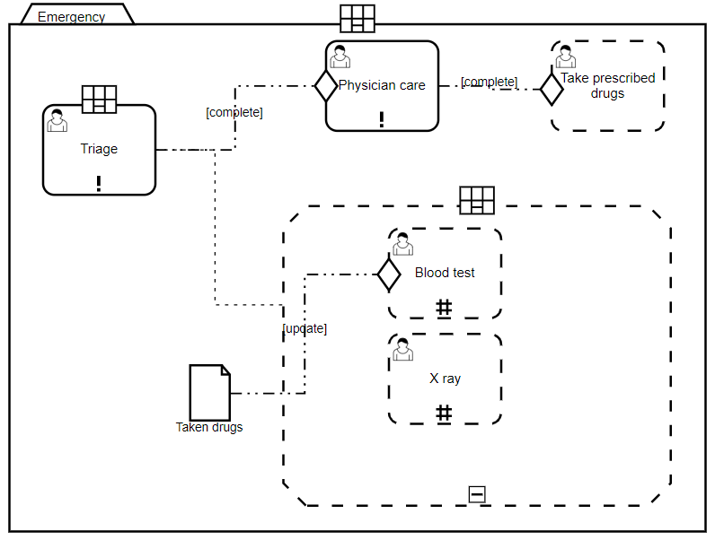
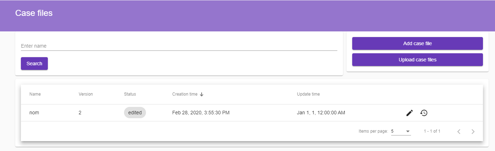
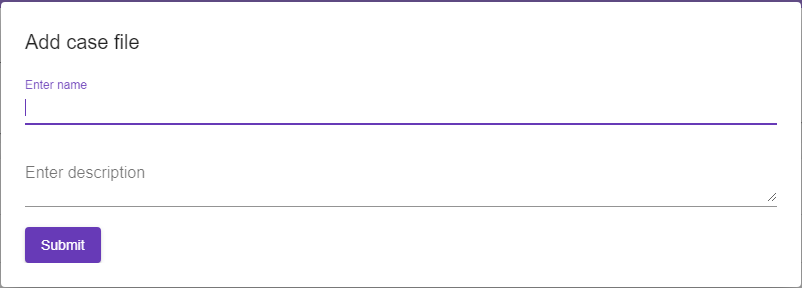
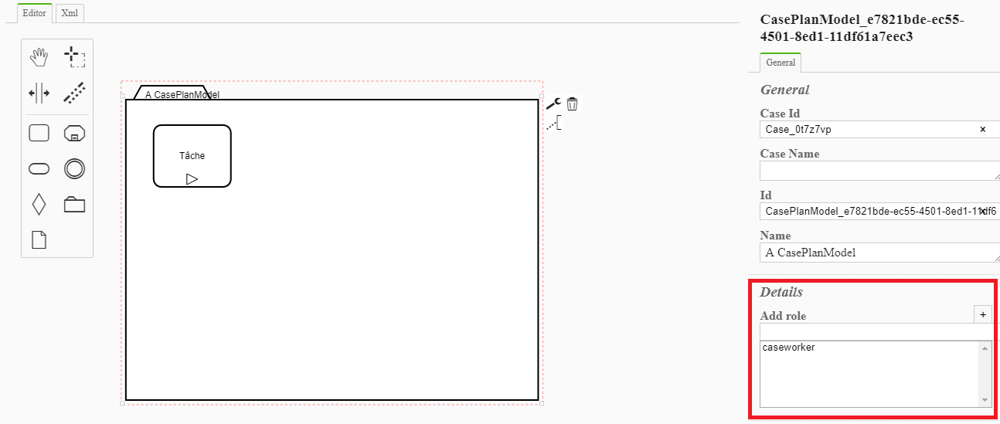
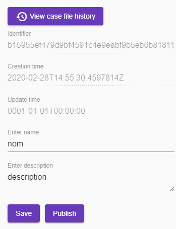

Publish case plan
=================

As a **business analyst** you can add and edit **case files**. 
Each case file contains one or more **case plan**, it can be expressed and modeled with Case Management Model And Notation (CMMN) version 1.1.

A **case plan** describes the process that involves actions taken regarding a **subject** in a particular **situation** to achieve a desired outcome :

* The **subject** of a case may be a person, a legal action or a business transaction. 
* The **situation** commonly includes data that inform and drive the actions taken in a case.

For example in an emergeny, patients must be sorted, those who can benefit from an immediate response and treatment at the highest level of care are identified, and those who can wait can receive advice or be directed to an appropriate service.
In this case the subject is the **patients**, the situation is the **degree of emergency** and the desired outcome is the treatment of the patients sorted by the degree of emergency.
The case is modeled below :

Add a case file
---------------

Browse the case management website, authenticate as a business analyst with the following credentials :

+--------------------+------------------------------------------------------------------------------------------------------------------------------------------------------------------------+
| Property           | Value                                                                                                                                                                  |
+====================+========================================================================================================================================================================+
| Login              | businessanalyst                                                                                                                                                        |
+--------------------+------------------------------------------------------------------------------------------------------------------------------------------------------------------------+
| Password           | password                                                                                                                                                               |
+--------------------+------------------------------------------------------------------------------------------------------------------------------------------------------------------------+

Under the **Cases** menu, click on **Case files**. The window displays the list of case files created by the authenticated business analyst.

Click on the button **Add case file**, fill in the form with a name and a description and submit it.

The user agent is redirected to a new window where the case file can be edited. By default the case file contains one case plan, its content can be edited by using the toolbar.
For more information about the different elements, please refer to reference.

.. image:: images/edit-casefile.png
   :align: center

Assign permissions
------------------

As a business analyst you can assign a list of roles to a case plan. 
Each role contains a list of case workers. At the moment the roles are not editable, they can be configured in the **Startup.cs** class of the **CaseManagement.CMMN.Host** project.

By default only one **caseworker** role with one **caseworker** user exists. 
This role can be assigned to the case plan by clicking on it and update the roles in the properties panel.

Save and publish case file
--------------------------

When the case file is complete, click on the button **Save** to save its content and click on **Publish** to publish the content.
When the case file is published, its version is incremented and its case plans are published.

