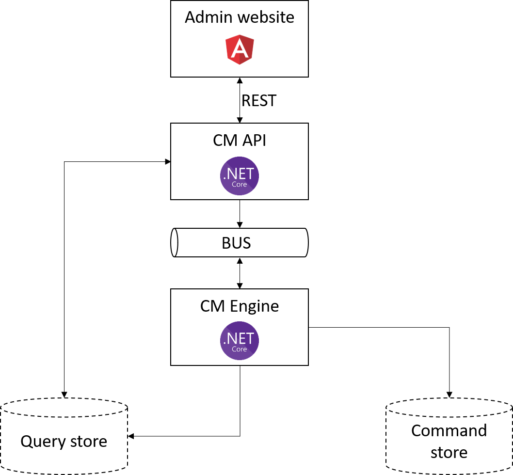
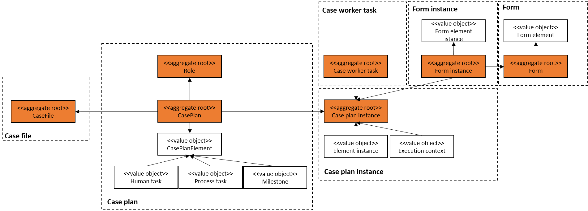

Architecture overview
=====================

* **CaseManagement (CM) Website** : the website is developed with angular. It is used by **case workers** or **business analysts** to manage the lifecycle of cases for example : manually activate a task or edit the definition of case plans.

* **Admin website** : this website is developed with angular. It is used by administrators to monitor the performance or view the logs.

* **Authorization server** : OAUTH2.0 server used by the solution to limit the access to certain API operations based on the **scopes** present in the access token, for example : the Gateway API client can get all the case plans from the CaseManagement API because it has access to the scope **get_caseplan**.

* **Identity server** : OPENID server used by the solution to authenticate the end-user and limit the access to certain API operations based on the claims of the end user, for example : only a user with the role **businessanalyst** can update a case plan.

* **CaseManagement (CM) API** : REST.API service which exposes operations to interact with the engine for example : update the case plan or launch a case plan instance.

* **CaseManagement Engine** : Execute a case plan instance.

Domain model
------------

The DDD aggregate pattern has been used to identify the different domain models present in the CaseManagement API.

Clustering model
----------------

The case engine can be distributed to different nodes in a cluster. Each case engine must then connect to a shared database.