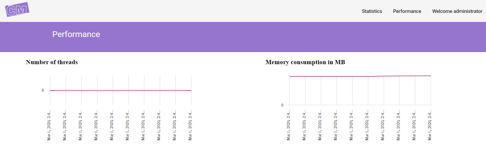

Monitor performance
===================

A case management engine can be hosted either in a windows service or in a website, and it can be installed on one or more machines.
Its performance can be followed in the administration website by administrator users.

**Number of threads** and **memory consumptions** are monitored every 4 seconds in every machines where the case management engine is installed.