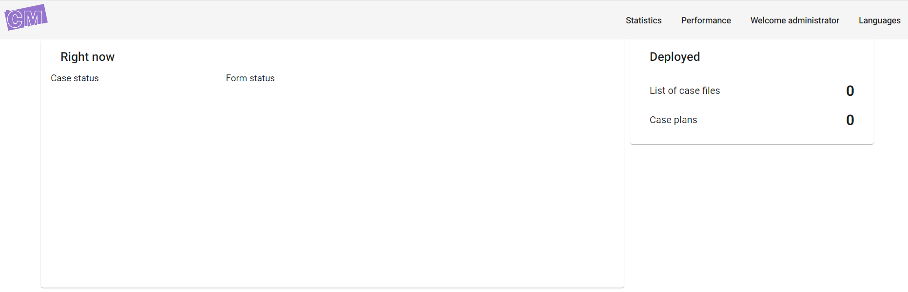

Monitor statistics
==================

As an administrator you can view different statistics :

* Number of cases created, closed or failed (today, since or week / month).
* Number of forms created or submitted (today, since or week / month).

Those statistics are accessible in the administration website, and can be accessed only by administrator users.

By default there is one administrator account configured, you can use the following credentials to authenticate as an administrator user :

+--------------------+------------------------------------------------------------------------------------------------------------------------------------------------------------------------+
| Property           | Value                                                                                                                                                                  |
+====================+========================================================================================================================================================================+
| Login              | administrator                                                                                                                                                          |
+--------------------+------------------------------------------------------------------------------------------------------------------------------------------------------------------------+
| Password           | password                                                                                                                                                               |
+--------------------+------------------------------------------------------------------------------------------------------------------------------------------------------------------------+