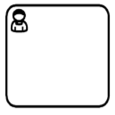
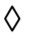
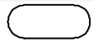

CMMN 1.1
========

Task
----

Human task
``````````

A HumanTask is a Task that is performed by a Case worker.



Parameters :

* **performerRef** : The performer of the HumanTask, a role must be specified for example : **caseworker**.
* **case:formKey** : Identifier of the form for example : **form**.

.. code-block:: XML
   
   <cmmn:humanTask id="HumanTask_1c177lg" name="HumanTask" performerRef="caseworker" case:formKey="form" />

Process task
````````````

A ProcessTask can be used in the Case to call a Business Process.


Parameters :

* **processRef** : A reference to a Process for example : **incrementtask**.
* **mappings** : Zero or more ParameterMapping objects. A ParameterMapping of a ProcessTask specifies how an input of the ProcessTask is mapped to an input of the called Process and how an output of the called Process is mapped to an output of the ProcessTask.
* **processRefExpression** : If processRefExpression is specified, it is assumed that the expression evaluates to a QName which is a valid QName of an existing Process.

.. code-block:: XML
   
   <cmmn:processTask id="ProcessTask_1ci0zd0" name="Repetition Task" processRef="incrementtask">
    <cmmn:parameterMapping sourceRef="increment" targetRef="increment" />
   </cmmn:processTask>

SEntries
--------

**Can be used by** : Stage, Tasks, Milestone.

A Sentry "watches out" for important situations to occur (or "events"), which influence the further proceedings of a Case (and hence their name).
A Sentry is a combination of an "event and/or condition." When the event is received, a condition might be applied to evaluate whether the event has effect or not. 



Parameters :

* **OnParts** : Defines the OnPart of the Sentry

   * **standardEvent** : Reference to a state transition in the lifecycle of a Stage, Task, EventListener or Milestone.

* **IfParts** : Defines the IfPart of the Sentry.

   * **condition** : A condition that is defined a Expression. The Expression MUST evaluate to boolean.

.. code-block:: XML

   <cmmn:sentry id="Sentry_0f4my3g">
    <cmmn:planItemOnPart id="PlanItemOnPart_0tuf377" sourceRef="PlanItem_18sdiyp">
     <cmmn:standardEvent>complete</cmmn:standardEvent>
    </cmmn:planItemOnPart>
    <cmmn:ifPart>
     <cmmn:condition>context.GetNumberVariable("increment") == 2</cmmn:condition>
    </cmmn:ifPart>
   </cmmn:sentry>
  
Milestone
---------

A Milestone represents an achievable target, defined to enable evaluation of progress of the case. No work is directly associated with a Milestone, but completion of set of tasks or the availability of key derivables typically leads to achieving a Milestone.



.. code-block:: XML

   <cmmn:milestone id="Milestone_0xqhnpq" name="milestone" />

Decorators
----------

Manual activation rule
``````````````````````

**Can be used by** : **Tasks** and **Stages**.


Specifies under which conditions **Tasks** and **Stages**, once enabled, start manually or automatically.

Parameters :

* **Condition** : A condition that is defined as an Expression. An expression that MUST evaluate to boolean. If the expression evaluates to FALSE, then the instance of the Task or Stage MUST be activated automatically when it is in stage Available, otherwise it MUST wait for manual activation.

.. code-block:: XML

   <cmmn:manualActivationRule id="ManualActivationRule_0wcl9eu">
    <condition>true</condition>
   </cmmn:manualActivationRule>

Repetition rule
```````````````

**Can be used by** : Tasks, Stages and Milestones.

.. image:: images/repetitionrule.png
   :align: center

A RepetitionRule specifies under which conditions **Tasks**, **Stages** and **Milestones** will have repetitions. Each repetition is a new instance of it.
The trigger of the repetition is SEntry, that is referenced as entry criterion, being satisfied, whereby an OnPart of that SEntry occurs. 

For example : A Task might be repeated each time a certain document is created.

Parameters :

* **Condition** : A condition that is defined as an Expression. An expression that MUST evaluate to boolean. If the expression evaluated to TRUE, then the instance of the Task, Stage or Milestone may be repeated, otherwise it MUST NOT be repeated.

.. code-block:: XML

   <cmmn:repetitionRule id="RepetitionRule_1a5vcca">
    <cmmn:condition>context.GetNumberVariable("increment") &lt; 2</cmmn:condition>            
   </cmmn:repetitionRule>